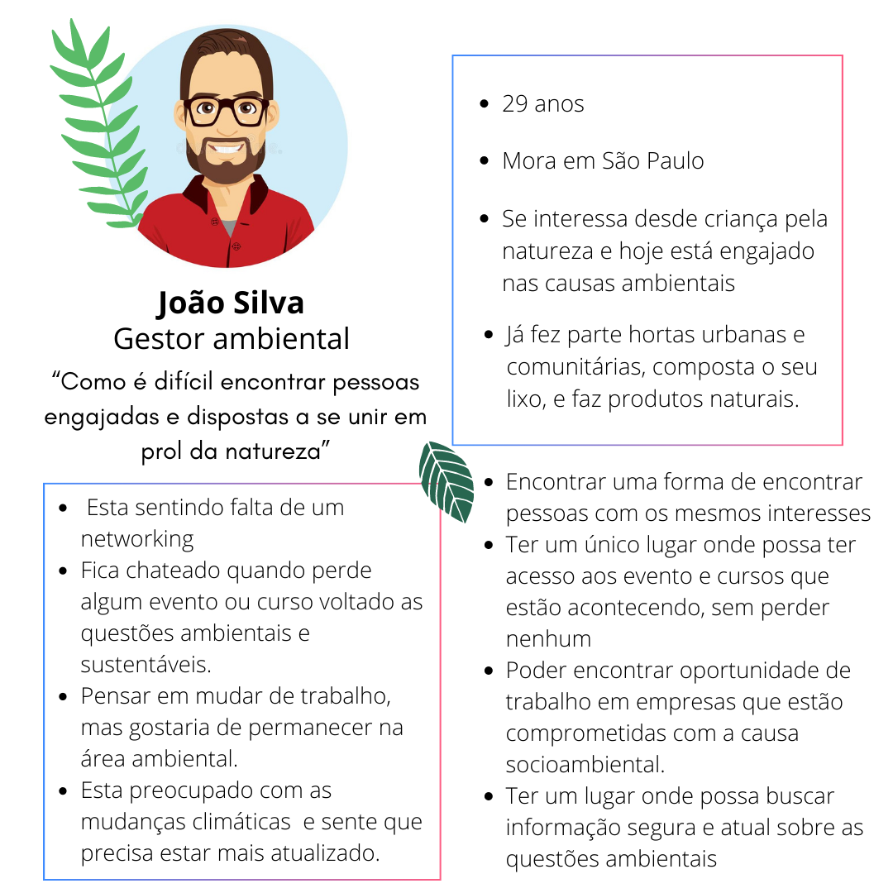
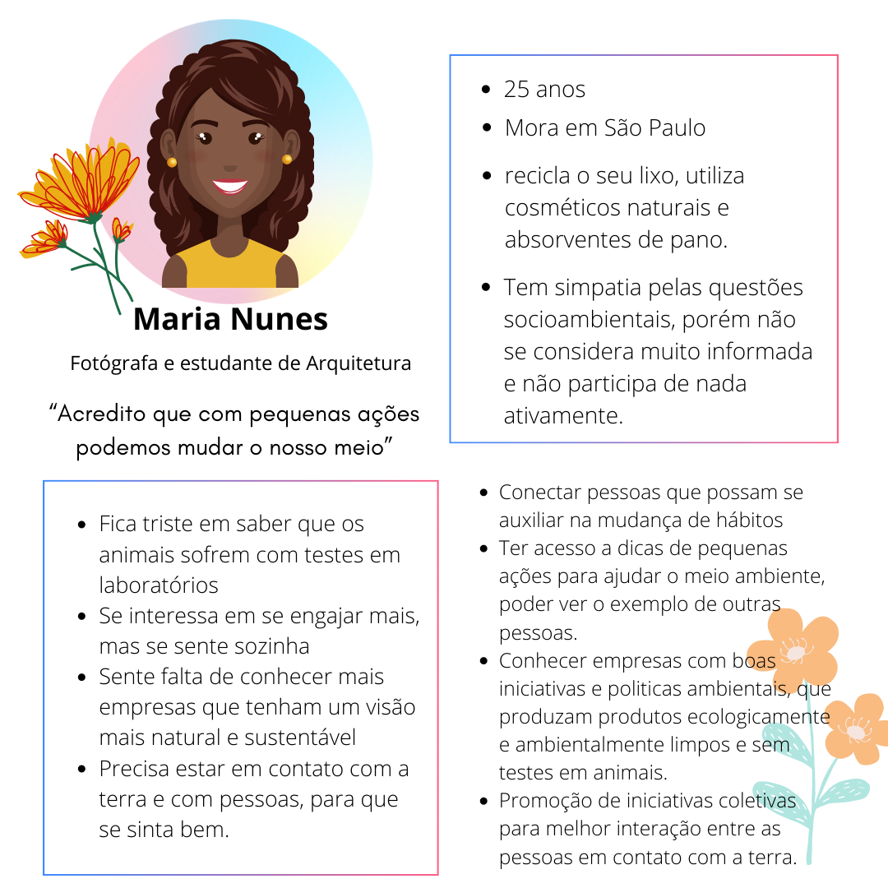
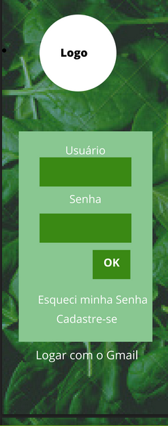
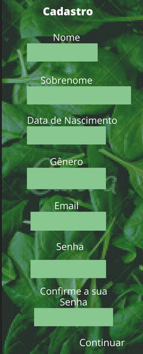
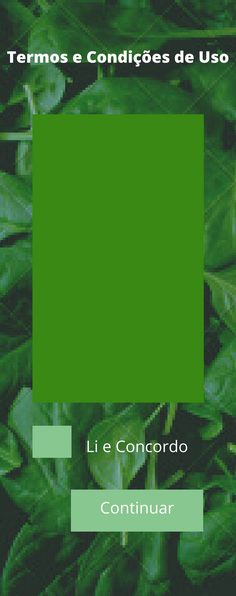
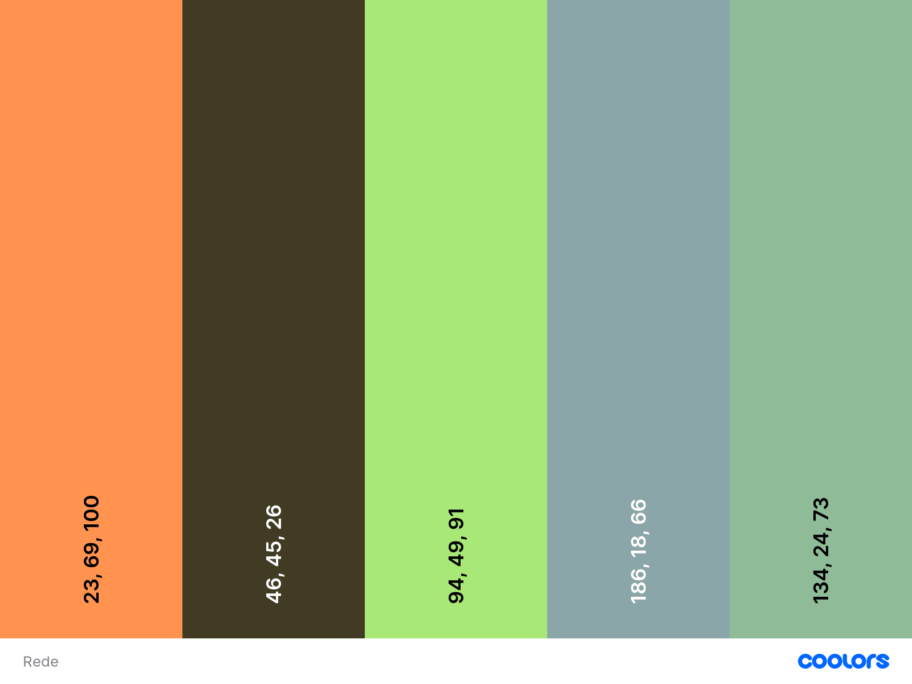
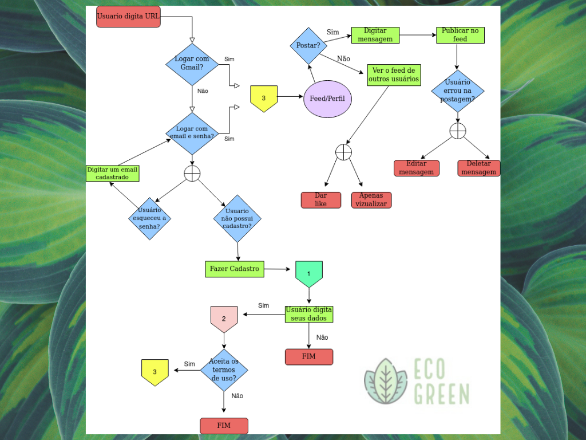

# Projeto Rede Social 

## Eco Green

- [1. Produto](#1-produto)
- [2. Personas](#2-personas)
- [3. Histórias de usuários](#3-histórias-de-usuários)
- [4. Interface](#4-Interface)
- [5. Desenho da Interface de Usuário (protótipo de baixa fidelidade) e fluxograma](#5-desenho-da-interface-de-Usuário-protótipo-de-baixa-fidelidade-e-fluxograma))
- [6. Implementações futuras](#4-implementacoes-futuras)
- [7. Tecnologias Utilizadas](#4-tecnologias-utilizadas)
- [8. Desenvolvedoras](#4-desenvolvedoras)

---

## 1. Produto

 

 Considerando o assunto que sempre estará em pauta, meio Ambiente, natureza, sociedade, efeitos do ser humano na natureza. Pensamos na necessidade de nossos usuários de trocar informações, apoiar projetos, se engajar mais na questões ambientais e sociais e desenvolvemos uma Rede Social, que possibilita que pessoas de todas as partes do mundo possam fazer essas trocas entre si. A Eco Green é uma rede social voltada exclusivamente para as temáticas socioambientais, seus usuários podem ser tanto pessoas físicas, quanto empresas, que estão engajados nas questão ambientais, ou que gostariam de se envolver e conhecer um pouco mais desse Universo. Acesse o site através do link: 

## 2. Personas

## 2. Histórias de usuários

  Necessidades atendidas

Tendo como referência as necessidades das personas "João" e "Maria" elaboramos as seguintes funcionalidades para nossas 4 sprints de desenvolvimento:

   Os usuários devem interagir entre si por meio de postagens, curtindo as postagens uns dos outros. Pessoas físicas e também empresas podem participar contanto que respeitem o tema da rede. Ter uma aba dentro do site contendo as principais e mais atuais informações sobre a temática. Os usuários devem poder criar, editar e deletar suas postagens. O usuário possa criar um novo cadastro ou se logar por meio de uma conta google. 

## 4. Interface

Atende a diferentes formatos de dispositivos e se trata de uma SPA (Single Page Application), para melhor experiência do usuário e menor tempo de espera para carregamento do conteúdo da página. É possível **ler, escrever, editar e excluir dados.**

### 5 Desenho da Interface de Usuário (protótipo de baixa fidelidade)

Para o nossa rede social, seguimos o seguinte layout:

 Escolhemos as seguintes cores, variando entre tons de verde, laranja e marrom, para que remetesse mais ao "natural"paleta de cores:

 
 
 Para a funcionalidade seguimos o seguinte fluxograma:

  

### 6 Implementações Futuras
- Persistência de dados (deletar, curtir, descurtir, linha do tempo)
- Termos de uso
- Campo "esqueceu a senha"
- criação de perfil de usuário
- blog de noticias

### 7 Tecnologias Utilizadas

    HTML
    Javascript
    CSS
    NodeJs
    Firebase/Firestore

### 8 Desenvolvedoras
<a href='https://github.com/anafreitas-br'>Ana Freitas</a>
 
<a href='https://github.com/edilenefern'>Edilene Fernandes</a> 
 
<a href='https://github.com/Fernandapy'>Fernanda Lima</a>

